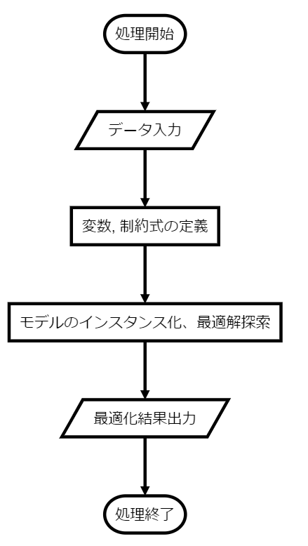

# GAMSマニュアル
最終更新日: 2020/03/10

本ファイルは、GAMS(General Algebraic Modeling System)の使用方法についてまとめている。  
GAMSは松橋研究室でよく使用されている、最適化計算用のソフトウェア。

## インストールの仕方
#### GAMSのダウンロード・インストール
https://www.gams.com/download/ にアクセスし、ライセンスのバージョン・使用環境（ラボのパソコンならWin-64bit）に適したインストールファイルをダウンロードする。このファイルを実行すれば、自動的にインストールされる。

※現在ラボにあるライセンスは ver.24.5.6 だが、古いのですでにインストールファイルの提供が終了している。MNAS/student/資料_document/GAMSライセンスファイル にライセンスおよびインストールファイルを保存してあるので、必要に応じて利用されたい。

※新年度に新しいライセンスを購入してもらおうと思います。

#### ライセンスファイルの使用
インストールが終わると、ライセンスの選択画面が現れる。その際、保存してあるライセンスファイル（テキストファイル）を選択するか、中身をコピーペーストすれば、ライセンス認証が完了する。

参考動画
- https://www.youtube.com/watch?v=vDnjGA5PImE
- https://www.youtube.com/watch?v=vSe3YGkUVoc

## プログラムの書き方

GAMSの基本的なプログラムの流れは以下の通り。  

<!--```flow
st=>start: 処理開始
e=>end: 処理終了
io1=>inputoutput: データ入力
op1=>operation: 変数, 制約式の定義
op2=>operation: モデルのインスタンス化、最適解探索
io2=>inputoutput: 最適化結果出力

st->io1->op1->op2->io2->e
```
-->


基本的にはこの流れで記述していけばよいので、プログラミング自体はそこまで必要にはならない。

#### キーワード
上図の上の処理から順に解説していく。
##### データ入力
* Sets

    添え字のこと。これを用いて各要素にアクセスする。
    例えば1日のシミュレーションをするとき、タイムステップが1時間ならtが1から24に動くようにセットする。(30分なら1~48)
    以下の例では、時間と発電機番号をセットとして定義しているが、例えばこれで、p(i,t)とアクセスすれば発電機iの時刻tにおける発電量を表していることになる。
<定義の仕方>
    ```
    name    description     /range/
    ```
    <例>
    ```
    Sets
    t                time                            /1*24/
    i                generator_id                    /1*27/
    ```
* Scalar

    スカラー値の定義、1個の値しか持たないため、Setsで定義された添え字ごとに違う値を持つなどの場合はParameterで定義。
    (ex. 太陽光発電の導入容量[GW]はシミュレーションを通して一定なのでスカラー値、太陽光発電の発電量は時刻に応じて変化するためParameter)
    下の例では、EVの総数を40台と定義。
    基本的に定数は大文字の名前をつけると変数と区別ができて可読性がいい。

    <定義の仕方>
    ```
    name    description     /value/
    ```

    <例>
    ```
    EV_NUM  Total number of EV /40/
    ```

* Parameter

    データタイプをParameterとするかTableにするかについては、[GAMSのドキュメント](https://www.gams.com/latest/docs/UG_DataEntry.html)にも書いてあるが、その値がいくつのセットに対して変化するかで決めればよい。
    基本的に、値が一つのセットに対して変化する場合はParameter、二つ以上のセットに対して変化する場合はTableで定義するのがよい。
    例えば、太陽光発電の発電量は時刻のみに対して変化するのでParameter、各家庭の電力需要みたいなデータは家のidと時刻の両方に対して変化するのでTableで定義するのがよい。
    <定義の仕方>
    ```
    parameter[s] 
    param_name[(index_list)] [text] [/ element [=] numerical_value
                                              {,element [=] numerical_value} /]
    {,param_name[(index_list)] [text] [/ element [=] numerical_value
                                              {,element [=] numerical_value} /]} ;
    ```

    <データ入力例>
    ```
    Parameter PV_Data(t)        'PV発電量[MWh]'
    / 1 0
      2 0
      3 0
      :
      12 3500
      13 3200
      :
      24 0
    /
    ;
    ```


* Table
    <定義の仕方>
    ```
    table table_name[(index_list)]  [text] [EOL
                    element               { element }     EOL
    element    numerical_value       { numerical_value} EOL
    {element    numerical_value       { numerical_value} EOL}] ;
    ```
    <例> JEPXの代表日ごとのプライスは、時刻と代表日のセットに対して変化するので以下のようにTable型で定義するのがいい。
    ```
    Table
    JEPX_Price(d)   JEPX Price of each representative day
        SW      SH      MW      MH      WW      WH
    1   5.2     6.4     7.2     6.8     6.4     7.0
    2   6.3     6.2     7.0     7.4     7.3     6.9
                :
    48  5.3     6.5     7.1     7.0     6.6     7.2
    ```
    データ入力に関しては、csvファイルやexcelファイルで入力することもできる。この辺はなかなか煩雑なので、先輩の書き方とか参考に書いてくのがいいと思われる。
##### 変数, 制約式の定義
##### モデルのインスタンス化、最適解探索
##### 最適化結果出力

#### モデル化時の注意点
- **最適化問題の種類について**
    
    **変数とパラメータの選択次第で最適化問題の種類が異なることに注意する。基本的に線形で解きたいなら、以下のことをしてはならない。**
    - **(変数)の二乗, log (変数), exp(変数)などの利用 (当たり前)**
    - **(変数) * (変数) を行う**
    - **条件式を用いて制約を書く時の条件に変数を使用する**

    <br/>
    以下これらについてすこし解説。  

    - **(変数) * (変数) を行う**
    
    例えば起動停止計画を考える。火力機の発電量の変数をp、稼働フラグをU (変数) として、火力機の定格運転制約を考えると、
    $$p_{i,t} \leq p_i^{max}$$
    これが動いている火力機のみ適用されるので、全ての辺に稼働フラグを掛けて、
    $$p_{i,t} \cdot U_{i,t} \leq p_i^{max} \cdot U_{i,t}$$
    となる。
    式自体は上式で間違いないが、これを実装すると、左辺が、(変数)×(変数)になっているため、混合整数線形計画では解けない。

    そこで、以下のように変形してやる必要がある。
    $$p_{i,t} \leq p_i^{max} \cdot U_{i,t}$$
    こうすれば、非稼働の場合は発電量は強制的に0になるし、稼働時は定格出力以下で制約してやることができる。

    今回は火力機で説明したが、蓄電池の出力上限の制約や燃料電池など、このテクニックはどのモデルにおいても適用可能だと思う。  
    <br/>

    - **条件式を用いて制約を書く時の条件に変数を使用する**

    モデルを書いていると、こういう条件だったらこういう制約が欲しいみたいなことがよくある。その際に、if文を使って対応できるのだが、この使い方には注意が必要である。

    例えば深夜(0<= t <= 6)の時間帯では燃料電池が停止するみたいな制約を書く場合、  

    ```
    def_stop_at_midnight(i,t)$(t.val le 6).. fc_output(i,t) =e= 0;
    ``` 

    とし、これは線形のまま解くことができる。

    しかしながら、例えば同時に蓄電池の運用を最適化してるとして、蓄電池が放電 (p_battery > 0) しているときに燃料電池が停止するみたいな場合、同じ要領でかくと、  

    ```
    def_stop_at_midnight(i,t)$(p_battery.val g 0).. fc_output(i,t) =e= 0;
    ```

    なるが (正しい記述方法は違うかもしれない...)、これをやると非線形になる点に気を付ける。
    このミス意外としてしまうケースが多いので、注意が必要である。例えば、需要データや太陽光発電の発電量など完全に分かってるとする場合、これらは変数ではなくパラメータとして入力させるべきである。
    **つまり、最初の例のように、条件式の中で使用されている値がパラメータや添え字 (Sets) の場合、線形性を崩さずモデル化できる。
    一方、後半の例のように、条件式の中で変数を使って評価した場合、非線形なモデルとなる。** 


    <br/>
- **ソルバーの選択に関して**

    **基本的によく使われるソルバーを以下に示す**
    - **MILP (Mixed Integer Linear Programming)の場合: gurobi, cplex**
    - **MINLP (Mixed Integer Non-Linear Programming)の場合: antigone**

    <br/>
    基本的に中身を知らなくても最適化計算は行ってくれるが、個人的な考えでは具体的にどうやって解を探索していってるかのイメージは持っておいてほしい。

    混合整数計画においてよく使われるのはBranch-and-BoundやBranch-and-cutと呼ばれる手法で、YouTubeなどで検索すればたくさんヒットするし、最適化ゼミでもやったことがあるのでその資料とかを参考に。


    <br/>
        
- **データの入力ファイルに関して** 

    データの入力方法として.xlsxや.csvを使うことがあると思うが、.xlsxの方がデータの読み取り時間が長かったような気がする。
    
    一回のシミュレーションにおいては、実行時間のみ気にすればいいと思うが、モンテカルロシミュレーションなどにより繰り返し最適化計算を実行する場合には、入力データを読み取る時間も無視できなくなってくる。

    ただ、csvファイルでデータを入力すると、多くのcsvファイルが必要になるので、User-friendlyではなくなっていくかもしれない。


## プログラムの実行と結果の確認